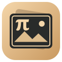

# Pi Reader

만화와 이미지를 편안하게 읽고, 원하는 크기와 배치로 인쇄하세요. 개인·교육·업무용으로 무료 사용할 수 있습니다.

[최신 버전 다운로드](https://github.com/cherub8128/Pi-Reader-Releases/releases/latest) · [앱 소개](https://pi-dimension.com/pages/pi-reader.html)

- 첫 이미지를 표지로 보여 주는 폴더 서재와 읽던 위치 저장
- 한 장·두 장·웹툰 보기, 좌우 읽기 방향, 확대·회전, 책갈피와 메모
- 일반 이미지와 ZIP·CBZ 열기, 데스크톱에서는 RAR·CBR도 지원
- mm 단위 크기·여백 조절, 여러 이미지 배치, 흑백 인쇄와 PDF 저장
- Noto 글꼴 내장, 새 버전 알림과 Windows 업데이트

## 어떤 파일을 받으면 되나요?

| 기기 | 선택할 파일 |
| --- | --- |
| Windows 10·11 64비트 | `windows-x64-setup.exe` 권장 · 설치 없이 쓰려면 `portable.exe` |
| Ubuntu·Debian 계열 64비트 | `linux-x64.deb` |
| 그 외 Linux 64비트 | `linux-x64.tar.gz` — 압축 안의 실행 준비 안내 참고 |
| Apple Silicon Mac | `mac-arm64-adhoc.zip` |
| Intel Mac | `mac-x64-adhoc.zip` |
| Android 7.0 이상 | `Pi-Reader-1.0.1-android.apk` |

Mac·Linux 버전은 시험 배포이며 해당 운영체제의 실행 확인이 아직 끝나지 않았습니다. Windows·Mac에서 개발자 확인 안내가 나타날 수 있으며, Mac 버전은 Apple 공증을 받지 않았습니다.

실행한 뒤 **폴더 추가** 또는 **파일 열기**로 시작하세요. 읽기와 PDF 저장에는 인터넷이 필요하지 않고, 원본 파일은 변경하지 않습니다. 업데이트와 다른 앱 목록은 인터넷으로 불러옵니다.

Windows 설치형을 이미지 연결 프로그램으로 사용하려면 Windows의 **연결 프로그램**에서 Pi Reader를 선택하세요. 탐색기 미리보기와 작은 앱 표시는 Windows 설정과 이미지 형식에 따라 달라집니다.

Android에서는 APK를 받아 설치한 뒤 **책 추가**에서 이미지 폴더나 ZIP·CBZ를 선택하세요. 두 손가락 확대, 읽던 위치·책갈피 저장, 여러 이미지 배치와 흑백 PDF 저장을 지원합니다. RAR·CBR은 지원하지 않으며, 압축 파일과 풀린 이미지 합계는 각각 512 MB까지입니다.

암호화·분할 압축, 7z, PDF 열기는 지원하지 않습니다. 데스크톱에서는 ZIP 2 GB, RAR 256 MB, 이미지 한 장 64 MB, 한 권 12,000페이지까지 지원합니다.

## 이용 안내

개인·교육·회사·기관의 업무용 사용과 조직 내부 설치를 무료로 허용합니다. 앱의 판매·외부 재배포는 제한됩니다. 자세한 조건은 [이용약관](LICENSE.txt), 포함된 오픈소스와 글꼴의 조건은 [라이선스 고지](THIRD_PARTY_NOTICES.md)를 확인하세요.

[Pi-Dimension](https://pi-dimension.com)
